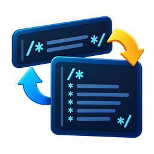

# Doxygen Comments Toggler

<p align="center">
  
</p>

Turn compact documentation comments into readable Doxygen blocks—and back again—without leaving the keyboard.

## What it does

Place the caret inside a supported comment and run **Toggle Doxygen Comment** (default shortcut: <kbd>Ctrl</kbd>+<kbd>D</kbd>, <kbd>Ctrl</kbd>+<kbd>D</kbd>). The command handles these cases:

### Trailing comments after code

A `//` comment following code toggles directly to an inline Doxygen comment and back without changing the code before it:

```cpp
auto count = connections.size(); // Number of active connections.
```

```cpp
auto count = connections.size(); /** Number of active connections. */
```

The caret must be inside the trailing comment, not in the code before it.

### Standalone slash comments

A `//` comment on its own line is promoted to a Doxygen comment:

```cpp
// Number of active connections.
```

```cpp
/** Number of active connections. */
```

Once in Doxygen form, it toggles between the single-line and multiline layouts described below.

### Consecutive `//` and `///` blocks

A contiguous block whose lines begin with `//`, `///`, or more slashes is converted as one comment block. With the default `consumeSlashes` setting, all leading slashes are removed:

```cpp
// Opens the connection.
/// Returns false when the endpoint is unavailable.
// Leaves the existing connection unchanged on failure.
```

```cpp
/**
 * Opens the connection. Returns false when the endpoint is unavailable.
 * Leaves the existing connection unchanged on failure.
 */
```

Wrapping depends on the configured width, so a short slash-comment block may fit into a single-line `/** ... */` comment.

### Single-line and multiline Doxygen comments

A single-line Doxygen comment toggles to the wrapped Doxygen style, and running the command again collapses it:

```cpp
/** Returns the number of active connections. */
```

```cpp
/**
 * Returns the number of active connections.
 */
```

### Caret and block preservation

Only the comment block containing the caret is rewritten. Adjacent code and separate comment blocks are left unchanged. After the edit, the extension maps the caret back to the corresponding position inside the transformed text, so it stays with the same part of the comment instead of jumping to the beginning or end.

The wrapping width is selected in this order:

1. The nearest supported formatter or lint config between the active file and its workspace root, when enabled.
2. The first value in `editor.rulers`, when enabled and present.
3. `doxygen-comments-toggler.wrapWidth`.
4. A fallback width of 80 columns.

Config discovery is language-aware and supports these common width settings:

| Ecosystem | Files and setting |
| --- | --- |
| C, C++, Objective-C, Java, JavaScript, TypeScript, C#, Proto | `.clang-format` or `_clang-format`: `ColumnLimit` |
| Prettier | Prettier config files or `package.json`: `printWidth` |
| ESLint | Flat/legacy ESLint config files or `package.json`: `max-len` (`code` or numeric form) |
| Biome and Deno | `biome.json` / `biome.jsonc` or `deno.json` / `deno.jsonc`: `lineWidth` |
| Python | `pyproject.toml` (Black or Ruff), `ruff.toml`, `.ruff.toml`, `setup.cfg`, or `.flake8`: `line-length` / `max-line-length` |
| Rust | `rustfmt.toml` or `.rustfmt.toml`: `max_width` |
| Ruby | `.rubocop.yml` or `.rubocop.yaml`: `Layout/LineLength` → `Max` |
| Dart | `analysis_options.yaml` or `analysis_options.yml`: `formatter.page_width` |
| Any language | Matching `.editorconfig` section: `max_line_length` |

JavaScript-based config files are read as text for a static numeric value; the extension never executes project config code.

## Usage

- Put the caret inside the specific `/** ... */`, standalone slash comment, consecutive slash-comment block, or trailing comment that you want to transform.
- Press <kbd>Ctrl</kbd>+<kbd>D</kbd>, <kbd>Ctrl</kbd>+<kbd>D</kbd>.
- Alternatively, open the Command Palette and choose **Toggle Doxygen Comment**.

The command acts only on the comment block under the caret; it does not toggle every comment in the file or selection.

The shortcut can be changed from **Preferences: Open Keyboard Shortcuts** by searching for `Toggle Doxygen Comment`.

## Settings

| Setting | Default | Purpose |
| --- | ---: | --- |
| `doxygen-comments-toggler.wrapWidth` | `120` | Maximum width used when no supported formatter config or editor ruler is available. |
| `doxygen-comments-toggler.consumeSlashes` | `true` | Removes all leading slashes from each slash-comment line instead of exactly two. |
| `doxygen-comments-toggler.searchFormatterConfig` | `true` | Reads the nearest supported formatter or lint config for the active file. |
| `doxygen-comments-toggler.useRulerAsWidth` | `true` | Uses the first configured `editor.rulers` value as the wrapping width. |

## WSL2-only development workflow

The intended toolchain keeps Node.js and npm inside WSL2. Windows hosts VS Code, but building, testing, debugging, packaging, and publishing all run in the WSL environment; no Windows Node.js installation is required.

### 1. Prepare WSL2

Install a WSL2 distribution and the **WSL** extension for VS Code. Then, in a WSL terminal, install Node.js with a Linux version manager such as `nvm`:

```bash
curl -o- https://raw.githubusercontent.com/nvm-sh/nvm/master/install.sh | bash
nvm install --lts
nvm use --lts
node --version
npm --version
```

For best file-system performance, clone the repository into the Linux file system (for example `~/src/doxygen-comments-toggler`) rather than working under `/mnt/c` or `/mnt/d`.

### 2. Install and build

From the repository in WSL:

```bash
npm ci
npm run compile
```

Open the folder through the WSL remote environment:

```bash
code .
```

Confirm that the lower-left VS Code status area shows a WSL connection. VS Code terminals, tasks, and npm scripts will then use the Node.js installation inside WSL.

### 3. Debug

In the WSL-connected VS Code window, press <kbd>F5</kbd> and choose **Run Extension** if prompted. The configured watch task compiles the TypeScript, and a new Extension Development Host opens with this extension loaded.

Set breakpoints in `src/extension.ts`, open a source file in the development host, place the cursor in a supported comment, and invoke **Toggle Doxygen Comment**.

### 4. Test

Run the full compile, lint, and extension test sequence from WSL:

```bash
npm test
```

The VS Code test runner may download a Linux build of VS Code on its first run. WSLg (available with current WSL2 installations) or an equivalent Linux display setup is needed for Electron-based extension tests.

Useful individual checks are:

```bash
npm run compile
npm run lint
```

### 5. Package and publish

Create a local `.vsix` package from WSL:

```bash
npm run package
```

Before a release, make sure the `development` branch is clean, up to date, and tracks `origin/development`. The version command is the complete local release action: it verifies the branch, runs the tests, updates the package version, creates the version commit and `vX.Y.Z` tag, and pushes the commit and tag:

```bash
git switch development
git pull --ff-only
npm version patch
```

Use `minor` or `major` instead of `patch` when appropriate. The pushed tag automatically starts `.github/workflows/publish.yml` on GitHub Actions. That Ubuntu-based workflow installs Node.js, verifies that the tag and package versions match, confirms that the tagged commit belongs to `development`, runs the tests, builds the VSIX, authenticates with Azure, and publishes the extension to the Visual Studio Marketplace.

Do not run `npm run publish:marketplace` as part of the normal local release process. That script is invoked by the automated workflow after the release tag is pushed. Check the GitHub Actions run and the Marketplace listing to confirm that publication completed successfully.

## Project commands

| Command | Description |
| --- | --- |
| `npm run compile` | Compile TypeScript into `out/`. |
| `npm run watch` | Recompile continuously while developing. |
| `npm run lint` | Check the TypeScript sources with ESLint. |
| `npm test` | Compile, lint, and run the VS Code extension tests. |
| `npm run package` | Build a VSIX package with VSCE. |
| `npm run publish:marketplace` | CI-only Marketplace publishing command invoked by the tagged-release workflow. |

